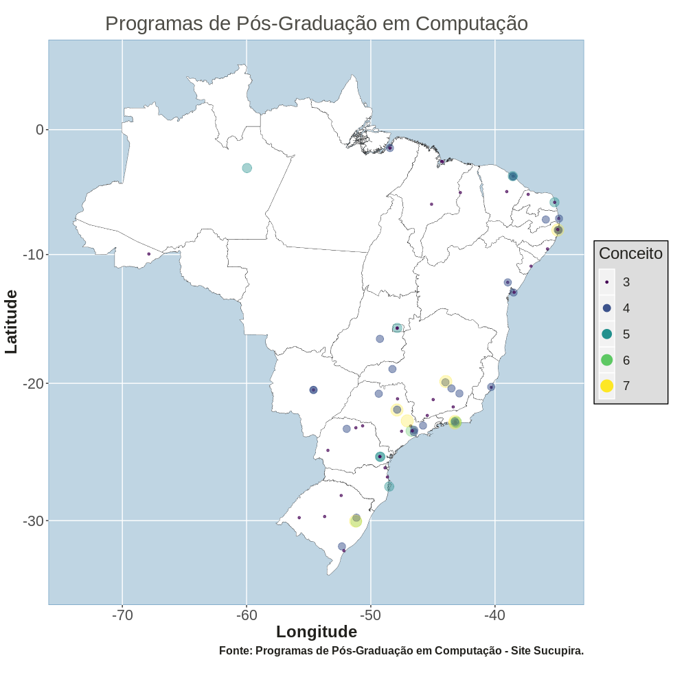
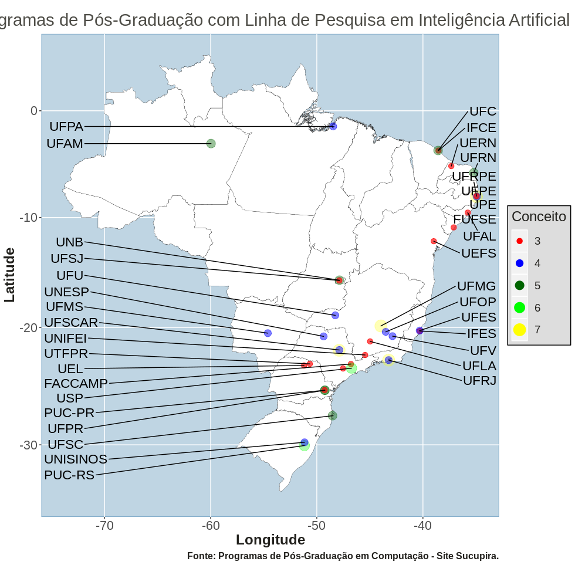
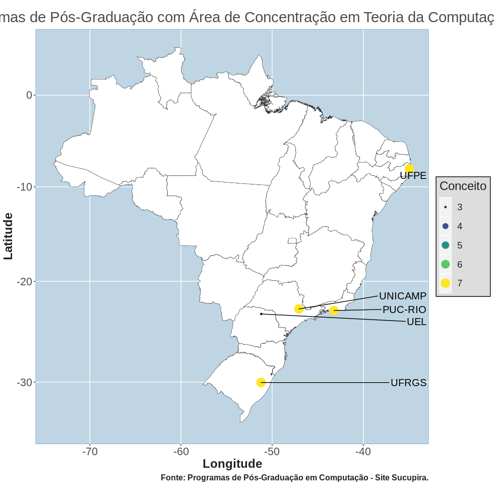
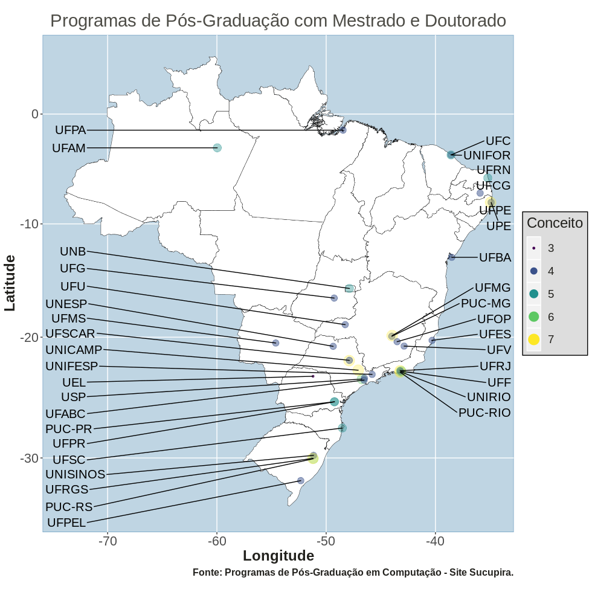

# Summary

This project aims to share the situation (and location) of Brazilian Graduating Programs in Computer Science and related areas.
The purpose is to realize an exploratory analysis of available data about the Computing Programs and generate meaningful visualizations.

# First Part

We will be based on this [document](https://capes.gov.br/images/stories/download/avaliacao/relatorios-finais-quadrienal-2017/20122017-CIENCIA-DA-COMPUTACAO-quadrienal.pdf) made by CAPES, the Brazilian organization responsible for Higher Education Programs evaluation.
Our attempt is to extract the needed information from this pdf file to perform our analysis. The information that we need are in pages 29-31.
The first thing to do is to load the needed packages.
```R
if (!require(pdftools)) {
  install.packages("pdftools", repos = "http://cran.us.r-project.org")
  require(pdftools)
}
if (!require(dplyr)) {
  install.packages("dplyr", repos = "http://cran.us.r-project.org")
  require(dplyr)
}
if (!require(readr)) {
  install.packages("readr", repos = "http://cran.us.r-project.org")
  require(readr)
}
if (!require(stringi)) {
  install.packages("stringi", repos = "http://cran.us.r-project.org")
  require(stringi)
}
if (!require(stringr)) {
  install.packages("stringr", repos = "http://cran.us.r-project.org")
  require(stringr)
}
if (!require(xlsx)) {
  install.packages("xlsx", repos = "http://cran.us.r-project.org")
  require(xlsx)
}
if (!require(rgdal)) {
  install.packages("rgdal", repos = "http://cran.us.r-project.org")
  require(rgdal)
}
if (!require(ggplot2)) {
  install.packages("ggplot2", repos = "http://cran.us.r-project.org")
  require(ggplot2)
}
if(!require(RColorBrewer)){
    install.packages("RColorBrewer")
    library(RColorBrewer)
}
if(!require(viridis)){
  install.packages("viridis")
  library(viridis)
}
if(!require(gganimate)){
  install.packages("gganimate")
  library(gganimate)
}
if(!require(ggrepel)){
  install.packages("ggrepel")
  library(ggrepel)
}
```
We load the data by lines using **pdf_text** and **read_lines**, select only the data of pages 29-31 (checking the file_pdf variable and selecting specific lines **1098:1190**) and eliminate some lines with **grep** function using header words like "Coordenação" and "Diretoria", meaning that the line has not useful information about the programs.
```R
file_pdf <- pdf_text("pdf/Evaluation report - Computer science.pdf") %>% read_lines()
file_pdf <- file_pdf[1098:1190]
file_pdf <- file_pdf[-(grep("CoordenaÁ„o", file_pdf))]
file_pdf <- file_pdf[-(grep("Diretoria", file_pdf))]
```
There were some lines that were not properly read (because of information format), so it was easier to remove them. Of course, after we need to include them manually. 
```R
file_pdf <- file_pdf[-(24:28)] #Remove UFBA-UNIFACS-UEFS 
file_pdf <- file_pdf[-(34:35)]
file_pdf <- file_pdf[-(75:76)]
file_pdf <- file_pdf[-(44:46)] #Remove UFSCAR-Sorocaba
file_pdf <- file_pdf[-(47:49)] #Remove USP-ICMC
```
Useless information in some lines were changed to an empty string using **gsub** and after we split all data using spaces as the spliting criteria (by lines) through **strsplit** command.
```R
file_pdf[56]<-gsub("-CA-MP","  ",file_pdf[56]) 
file_pdf[57]<-gsub("-IN-MP","  ",file_pdf[57]) 
file_pdf <- strsplit(file_pdf, "  ")
```
Now we use the following loop to remove the empty spaces generated above. The result is stored in **list_pdf**.
```R
list_pdf <- 0
a <- 1
for(i in 1:length(file_pdf)){
    info_number <- length(file_pdf[[i]][!stri_isempty(file_pdf[[i]])])
    for(j in 1:info_number){
        list_pdf[a] <- str_trim(file_pdf[[i]][!stri_isempty(file_pdf[[i]])][j])
        a <- a + 1
    }
}
```
Now we create a new dataframe with the columns we want with **data.frame** command, initializing them with zeros. The loop catches every data needed by feature and stores in the new dataframe. 
```R
data_pdf <- data.frame(stringsAsFactors = FALSE, "Universidade" = 0, "Curso" = 0, "Nivel" = 0, "Nota" = 0)
a <- 1
for(i in seq(from = 2, to = length(list_pdf), by = 5)){
    data_pdf[a,1] <- list_pdf[i]
    data_pdf[a,2] <- list_pdf[i+1]
    data_pdf[a,3] <- list_pdf[i+2]
    data_pdf[a,4] <- list_pdf[i+3]
    a <- a + 1
}
```
Finally, we save this data into a xlsx file with **write.xlsx** command. Here we end the first part.
```R
write.xlsx(data_pdf, file = "csv/universities_before.xlsx", col.names = TRUE, row.names = TRUE, append = FALSE)
```
NOTE: To verify if all Computer Graduating Programs were included, we checked the [Sucupira Website](https://sucupira.capes.gov.br/sucupira/public/consultas/coleta/programa/quantitativos/quantitativoIes.jsf?areaAvaliacao=2&areaConhecimento=10300007). There we verified that 11 Programs were missing, so we manually inserted them and also included the foundation year, latitude/longitude and city id. The city id was got from [here](https://github.com/kelvins/Municipios-Brasileiros/tree/master/csv), where we got the Brazilian states and cities information. The shapefile that we will use was got from [here](http://www.uel.br/laboratorios/lapege/pages/base-de-dados-shp-do-brasil.php). You can get from [here](http://forest-gis.com/download-de-shapefiles/) too.
We also included the research topics of each one of the programs. To do that we went to each website of each program and registered each research topic. 
The structure of all extracted and collected data is divided in the following files:
- universidades.xlsx: information by university (id, university name, university code, course, program level, concept, latitude, longitude, city id and foundation year)
- municipios.xlsx: all Brazilian cities, with state id to identify the state. 
- state.xlsx: all Brazilian states, with state id to be used with municipios.xlsx.
- temas_pesquisa.xlsx: all research topics with an id to be used with the universidade_pesquisa.xlsx.
- universidade_pesquisa.xlsx: the joining between universities and their research topics, with an extra column called **id_mestrado_doutorado** to identify the level of each research topic: 0 to professional master degree, 1 to academic master degree, 2 to doctoral/PHd degree and 3 to both master and doctoral degree.

# Second Part
Now we have all data needed to perform our analysis. First we load the needed data and check how they are organized.

```R
brazilian_states <- read.csv("csv/brazilian_states.csv",sep=",", stringsAsFactors=FALSE, encoding = "UTF-8")
brazilian_cities <- read.csv("csv/brazilian_cities.csv",sep=",", stringsAsFactors=FALSE, encoding = "Latin-1")
universities <- read.xlsx("csv/universities_after.xlsx", sheetIndex = 1, encoding = "UTF-8")
university_research <- read.xlsx("csv/university_research.xlsx", sheetIndex = 1, encoding = "UTF-8")
research_names <- read.xlsx("csv/research_names.xlsx", sheetIndex = 1, encoding = "UTF-8")
shape_brazil <- readOGR("shapefile/Brazil.shp", "Brazil",use_iconv=TRUE)
colnames(brazilian_states)[1]<-"codigo_uf"
```

Now we join the data from all excel files to a single dataframe, using **left_join** function. We also prepare the shapefile to dataframe format, using **broom::tidy** **and inner_join** (dataframe is the data structure that can be dealed by ggplot functions).

```R
all_data <- universities %>% left_join(brazilian_cities, by = c("Codigo_Cidade" = "codigo_ibge"))
all_data <- all_data %>% left_join(brazilian_states, by = c("codigo_uf" = "codigo_uf"))
all_data <- all_data %>% left_join(university_research, by = c("id" = "id_universidade"))
all_data <- all_data %>% left_join(research_names, by = c("id_pesquisa" = "id_ordenado"))

shape_brazil@data$id <- rownames(shape_brazil@data)
shp_df <- broom::tidy(shape_brazil, region = 'id')
shape_brazil <- shape_brazil@data %>% inner_join(shp_df, by = c("id" = "id"))
```

From now on we will not use the ids, so we removed them too. We also convert the **lat/long** and **Nota** data to numeric format.

```R
all_data<-all_data[,-9]
all_data<-all_data[,-13]
all_data<-all_data[,-13]
all_data<-all_data[,-15]

colnames(all_data)[7]<-"lat_university"
colnames(all_data)[8]<-"long_university"
all_data$lat_university <- as.numeric(as.character(all_data$lat_university))
all_data$long_university <- as.numeric(as.character(all_data$long_university))
all_data$Nota <- as.numeric(as.character(all_data$Nota))
```

To generate the map below, we will use **ggplot** and some other functions. Let's understand the logic behind it.

```R
1.  mybreaks <- as.numeric(c(3, 4, 5, 6, 7))
2.  ggplot() + 
3.  geom_polygon( data = shape_brazil, aes(x = long, y = lat, group = group), fill = "grey", alpha = 0.3) +
4.  geom_path( data = shape_brazil, aes( x = long, y = lat, group = group), color = "black", size = 0.1) +
5.  geom_point( data = all_data, aes(x = long_university, y = lat_university, size = Nota, color = Nota, alpha = rev(Nota))) +
6.  scale_color_viridis(name = "Conceito", breaks = mybreaks) +
7.  scale_size_continuous(name = "Conceito", breaks = mybreaks) +
8.  coord_map() + 
9.  guides( colour = guide_legend(), alpha = FALSE) +
10. ggtitle("Programas de PÛs-GraduaÁ„o em ComputaÁ„o") +
11. labs(x = "Longitude", y = "Latitude") +
12. theme(
13.    legend.position = c(0.9, 0.15),
14.    text = element_text(color = "#22211d"),
15.    plot.background = element_rect(fill = "#f5f5f2", color = NA), 
16.    panel.background = element_rect(fill = "#f5f5f2", color = NA), 
17.    legend.background = element_rect(fill = "#dddddd", color = "black"),
18.    plot.title = element_text(size= 16, hjust=0.5, color = "#4e4d47"))
```



Line 1: **mybreaks** is a variable to be used to assign all possible values to the legend.
Line 2: main **ggplot** function to generate graphics.
Line 3: **geom_polygon** is used to plot the map. Inside of **aes** we use all aesthetics we need to the polygons. We use the shape as the data (outside of aes), longitude as **x-axis**, latitude as **y-axis** and group as the **group** (generated variable when we transformed shapefile to dataframe, to group the information). **fill** argument is used to coloring and **alpha** argument is the transparency level of filling.
Line 4: **geom_path** is used to plot the lines of the map. The arguments data and aes are the same from geom_polygon.
Line 5: **geom_point** is used to plot points in the map. The **data** argument is the dataframe with data from Computing Graduating Courses.  Aes argument: **x-axis** receives the longitude and **y-axis** receives the latitude from universities. The **size** argument is about the point size for each sample. The **color** argument is about the point color for each sample. The **alpha** argument is the same presented previously. These three arguments will be proportional to the "Nota", a sinthetized value that represent (or should be) the quality of Brazilian Graduating Programs.
Line 6: **scale_color_viridis** is used to set what colors to use in the points. We give a **name** to be used in the legend and what are the possible values in the **breaks** argument, giving the value of **mybreaks**.
Line 7: **scale_size_continuous** is used to set the size of the points. We give a **name** to be used in the legend and what are the possible values in the **breaks** argument, giving the value of **mybreaks**.
Line 8: **coord_map** is used to preserve the real proportions of latitude and longitude.
Line 9: **guides** is used to set all the scales in the legend. In our case, we set the color scale using **guide_legend** in the **colour** argument. We do not want to use the **alpha**, so we set **alpha** to FALSE. 
Line 10: **ggtitle** is used to set title to the whole plot.
Line 11: **labs** is used to set x-axis legend (**x** argument) and y-axis legend (**y** argument).
Line 12: **theme** is used to customize other graphical elements, including legends, background, panels and others.
Line 13: **legend.position** is used to set the right place for the legend box.
Line 14: **text** is used to set the text color, in general.
Line 15: **plot.background** is used to customize the plot background. We use the **fill** argument (inside of **element_rect**) to set the filling color. **color** argument is used to set the plot borders color.
Line 16: **panel.background** is used to customize the panel background.We use the **fill** argument (inside of **element_rect**) to set the filling color. **color** argument is used to set the panel borders color.
Line 17: **legend.background** is used to customize the legend background. We use the **fill** argument (inside of **element_rect**) to set the filling color. **color** argument is used to set the legend borders color.
Line 18: **plot.title** is used to customize the plot title, using the **element_text** element. We customized the title size using **size** argument, **hjust** to adjust the horizontal title position and **color** to set the text color. 
  
Now we create a gif using **animate**. We first change the values from **id_mestrado_doutorado** colunm to match with the shapes we want to plot after. **shadow_mark** with **past** argument is used to ensure that the points generated by previous frames continue in the plot. The **frame_time** in ggtitle is used to plot each different year in the title when the frame is changed. Transition_time is what argument we will use to separate each frame.

```R
all_data$id_mestrado_doutorado <- all_data$id_mestrado_doutorado + 14
p <- ggplot(data = all_data, aes(group = Ano)) +
    geom_polygon( data = shape_brazil, aes( x = long, y = lat, group = group), fill = "white") +
    geom_path( data = shape_brazil, aes( x = long, y = lat, group = group), color = "black", size = 0.05) +
    geom_point( data = all_data, aes(x = long_university, y = lat_university, size = 4, color = as.factor(Nota), alpha = 0.05, group = Ano, shape = as.factor(id_mestrado_doutorado))) +
    scale_color_manual(name = "Conceito", breaks = mybreaks, values = c("red","orange","yellow","dark green","light green")) +
    scale_shape_manual(name = "NÌvel", values = c(15, 17, 18, 19), labels = c("Mestrado Profissional","Mestrado","Doutorado","Mestrado + Doutorado")) +
    coord_map() +
    shadow_mark(past = TRUE) +
    guides( colour = guide_legend(override.aes = list(size = 8)), shape = guide_legend(override.aes = list(size=8)), alpha = FALSE, size = FALSE) +
    ggtitle("Programas de PÛs-GraduaÁ„o em ComputaÁ„o em {round(frame_time,0)}") +
    labs(x = "Longitude", y = "Latitude") +
    transition_time(Ano) +
    theme(
      legend.title = element_text(size = 18), 
      legend.text = element_text(size = 14),
      legend.key.size = unit(1.0, "cm"),
      legend.key.width = unit(0.4,"cm"),
      legend.position = c(0.15, 0.25),
      text = element_text(color = "#22211d"),
      plot.background = element_rect(fill = "#f5f5f2", color = NA), 
      panel.background = element_rect(fill = "#f5f5f2", color = NA), 
      legend.background = element_rect(fill = "#f5f5f2", color = NA),
      plot.title = element_text(size = 20, hjust = 0.1, color = "black"))

animate(p, nframes = 52, fps = 1, width = 1800, height = 900, renderer = gifski_renderer("images/figure2.gif", loop = FALSE)) + ease_aes('cubic-in-out')
```


If you want to generate video instead of gifs, you can use the **animate** function below with **ffmpeg_renderer**. Note: you need first to download and install the [ffmpeg] (https://ffmpeg.org/download.html) in your system.

```R
 animate(p, nframes=56, fps = 2, width = 1800, height = 900, renderer = ffmpeg_renderer()) + ease_aes('cubic-in-out')
```
Programs with Artificial Intelligence.

```R
ggplot() + 
  geom_polygon( data = shape_brazil, aes(x = long, y = lat, group = group), fill = "grey", alpha = 0.3) +
  geom_path( data = shape_brazil, aes( x = long, y = lat, group = group), color = "black", size = 0.1) +
  geom_point( data = all_data[all_data$nome=="Inteligencia Artificial",], aes(x = long_university, y = lat_university, size = as.factor(Nota), color = as.factor(Nota), alpha = 0.7)) +
  scale_colour_manual(name = "Conceito", values = c("red","blue","dark green","green","yellow")) +
  scale_size_manual(name = "Conceito", values = c(3,4,5,6,7)) +
  coord_map() + 
  guides( alpha = FALSE) +
  ggtitle("Programas de PÛs-GraduaÁ„o em InteligÍncia Artificial") +
  labs(x = "Longitude", y = "Latitude") +
  theme(
    legend.position = c(0.9, 0.15),
    text = element_text(color = "#22211d"),
    plot.background = element_rect(fill = "#f5f5f2"), 
    panel.background = element_rect(fill = "#f5f5f2"), 
    legend.background = element_rect(fill = "#dddddd", color = "black"),
    plot.title = element_text(size= 16, hjust=0.5, color = "#4e4d47"))
```



Programs with Computer Theory.

```R
ggplot() + 
  geom_polygon( data = shape_brazil, aes(x = long, y = lat, group = group), fill = "grey", alpha = 0.3) +
  geom_path( data = shape_brazil, aes( x = long, y = lat, group = group), color = "black", size = 0.1) +
  geom_point( data = all_data[all_data$nome=="Teoria da ComputaÁ„o",], aes(x = long_university, y = lat_university, size = Nota, color = Nota, alpha = 0.3)) +
  scale_color_viridis(name = "Conceito", breaks = mybreaks) +
  scale_size_continuous(name = "Conceito", breaks = mybreaks) +
  coord_map() + 
  guides( colour = guide_legend(), alpha = FALSE) +
  ggtitle("Programas de PÛs-GraduaÁ„o em Teoria da ComputaÁ„o") +
  labs(x = "Longitude", y = "Latitude") +
  theme(
    legend.position = c(0.9, 0.15),
    text = element_text(color = "#22211d"),
    plot.background = element_rect(fill = "#f5f5f2"), 
    panel.background = element_rect(fill = "#f5f5f2"), 
    legend.background = element_rect(fill = "#dddddd", color = "black"),
    plot.title = element_text(size= 16, hjust=0.5, color = "#4e4d47"))
```



Programs with both Master and Doctoral degree.

```R
ggplot() + 
  geom_polygon( data = shape_brazil, aes(x = long, y = lat, group = group), fill = "white", alpha = 0.3) +
  geom_path( data = shape_brazil, aes( x = long, y = lat, group = group), color = "grey", size = 0.1) +
  geom_point( data = all_data[all_data$Nivel == "MESTRADO/DOUTORADO",], aes(x = long_university, y = lat_university, size = Nota, color = Nota, alpha = 0.3)) +
  geom_text_repel( data = all_data[!duplicated(all_data$Sigla) & all_data$Nivel == "MESTRADO/DOUTORADO",], aes(x = long_university, y = lat_university, label = Sigla, size = 5), hjust = 0.1, nudge_x = 1, show.legend = FALSE) +
  scale_shape_identity() +
  scale_color_viridis(name = "Conceito", breaks = mybreaks) +
  scale_size_continuous(name = "Conceito", breaks = mybreaks) +
  coord_map() + 
  guides( colour = guide_legend(), size = guide_legend(), alpha = FALSE, label = FALSE, text = FALSE) +
  ggtitle("Programas de PÛs-GraduaÁ„o com Mestrado e Doutorado") +
  labs(x = "Longitude", y = "Latitude") +
  theme(
    legend.position = c(0.9, 0.15),
    text = element_text(color = "#22211d"),
    plot.background = element_rect(fill = "#f5f5f2"), 
    panel.background = element_rect(fill = "#f5f5f2"), 
    legend.background = element_rect(fill = "#dddddd", color = "black"),
    plot.title = element_text(size= 16, hjust=0.5, color = "#4e4d47"))
```




